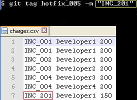

# git-hfc custom command

Custom Git Command to Control Hotfix cost.

````
- shell script (bin/sh)
- html
- json
- javascript (d3.v3.min)
````

## Overview

"hfc" is a custom git command to create dendrogram (tree-structured graph) where you can see
info about hotfix and its relations with incidents, developers and their charges by incident.


<br>


Features:

- Control hotfix cost by incident and developers to local or remote server.
- Visual reporting HTML.

## Installation

Linux:

Copy git-hfc from bin directory to /usr/lib/git-core/

Make the file executable.

Windows:

Copy git-hfc from bin directory to C:\Program Files\Git\libexec\git-core  

Both (Linux/Windows)


Copy csv file (charges.csv) with charges by incidents and developers in git-hfc directory. 

charges file should have this structure:

INC_XXX ID_DEVELOPER TOTAL CHARGES

## How tagging

Make tag with "hotfix" prefix and add like comment the incident id with "INC_" prefix.



## Check it work and/or Usage

```
Start git bash and type:

git hfc

New command should work, demdogram is created with
all hotfix tags, developers and charges. See git-hfc directory.

```